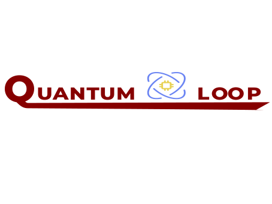

# The Quantum Loop

## Who are we
The Quantum Loop is an organization created to provide software to the people.

It currently consists of 2 developer. [@porfanid](https://github.com/porfanid) and [@Vaggtzm](https://github.com/Vaggtzm).
Together, the 2 of us are devoting our free time to create, host and publish different projects that will interest many different people.

## Members

### Pavlos Orfanidis ([porfanid](https://github.com/porfanid))

Pavlos is the back-end developer. He is working on nodejs using the firebase nosql or a mariadb database to store the data he requires for each project he creates. He can code anything you want using [![Node][Node.js]][Node-url], PHP, Java, Bash, C, C++ and other programming languages that you can ind on his [GitHub Profile](https://github.com/porfanid)

### Vaggelis Tzimas ([Vaggtzm](https://github.com/Vaggtzm))

Vaggelis is the front-end developer. He can manipulate the css data to style a website in any way you want. He is can use plain html, css and javascript, but he is also learning [![React][React.js]][React-url]. You can find many of his projects at his [GitHub Profile](https://github.com/Vaggtzm)

[React.js]: https://img.shields.io/badge/-ReactJs-61DAFB?logo=react&logoColor=white&style=for-the-badge
[React-url]: https://react.dev/
[Node.js]: https://img.shields.io/badge/Node.js-35495E?style=for-the-badge&logo=nodedotjs&logoColor=4FC08D
[Node-url]: https://nodejs.org/
## Where you can find us

You can find us at our social media platforms:

 - Instagram: [@porfanid](https://instagram.com/porfanid) and [@vagellis.dev](https://instagram.com/vagellis.dev)
 - Github: [@porfanid](https://github.com/porfanid) and [@Vaggtzm](h    ttps://github.com/Vaggtzm)
 - Twitter: [@paul_porfanid](https://twitter.com/paul_porfanid) and [@vaggelis_tzim](https://twitter.com/vaggelis_tzim)

## Contribution to the repositories
If you want to contribute to any of these repos, you are most welcome to. But of course, you are going to have to follow the contribution guidelines that each project has

<!--
In our repositories you can find many projects that we have created.
-->
<!--

**Here are some ideas to get you started:**

🙋‍♀️ A short introduction - what is your organization all about?
🌈 Contribution guidelines - how can the community get involved?
👩‍💻 Useful resources - where can the community find your docs? Is there anything else the community should know?
🍿 Fun facts - what does your team eat for breakfast?
🧙 Remember, you can do mighty things with the power of [Markdown](https://docs.github.com/github/writing-on-github/getting-started-with-writing-and-formatting-on-github/basic-writing-and-formatting-syntax)
-->
